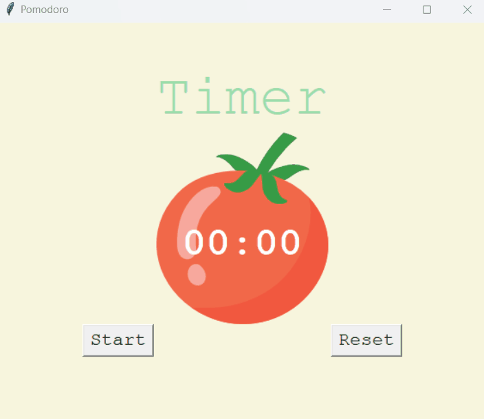
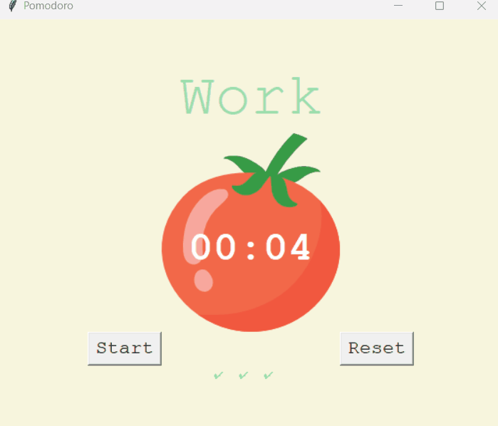

# Pomodoro

## Pomodoro app built in Python with Tkinter GUI

> ### Features
>
> - "Start" and "Reset" timer
> - Four 25 min "Work" cycles, each followed by a 5 min "Break" cycle
> - Every 5th break is a "Long Break" lasting 20 min

<br>



### Start Pomodoro timer

<br><br>



### Reset timer to clear Pomodoro

<br><br><br>

## Setup

1. Clone the Pomodoro repository.
2. Run the following command in the terminal.

```sh
python main.py
```
